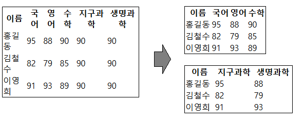

# react-responsive-table
> A flexible and extensible React library for building responsive data tables


## Features

- Designed with mobile and small screens in mind
- Break wide tables into manageable sections


## Usage
todo: 추가하기!!

## Installation
```bash
npm install react-responsive-table
```

## License
[Park Seong Kyeong](https://github.com/parkbible)